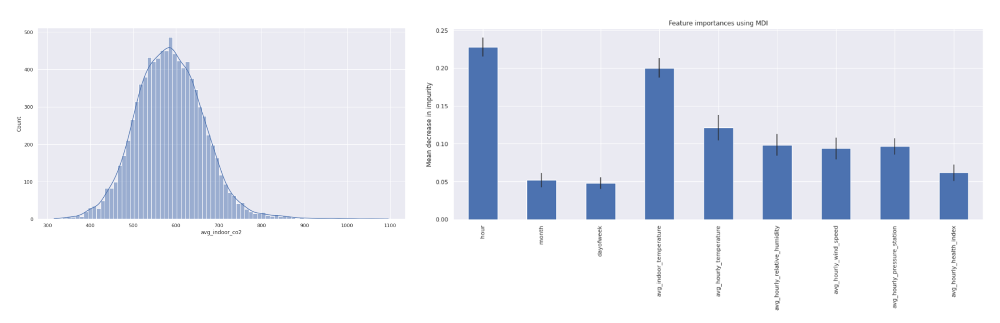

# weather-co2

## Overview  
I analyze the impact of **indoor** and **outdoor** **factors** on the **level of CO2** in a room using one household data collected over a period of one year.   

The indoor data has been collected as part of a Smart Home DIY solution and it includes date, hour, average indoor CO2, average indoor humidity, average indoor temperature.
The outdoor data has been sourced from Canada Weather Stats and it includes date, average temperature, average humidity, average dew point, average wind speed, average pressure, average health index, precipitation.  

The Random Forest model is used to **predict** the level of indoor CO2 using source features and to rank the **impact** of the **features** on the prediction.  

  

  

The **exploratory** analysis shows that the levels of CO2 are normally distributed around the household target.  
The **predictive** analysis shows that the **features with the most importance** are the hour and the average indoor temperature.   

The results of the analysis suggest that no matter the outdoor weather, CO2 levels can be managed with **air flow regulation** (opening windows).  
This link seems intuitive, but it was dismissed by other researchers in a different context, as discussed in the detailed report.   

## List of files  
[Source data](data/)  
[Colab notebook that preprocesses data and analyses it](model/Olga_Terekhova_Weather_CO2.ipynb)  
[Detailed report on the project](report/Olga_Terekhova___Mothers_and_Machine_Learning_Capstone_Project.pdf)  
